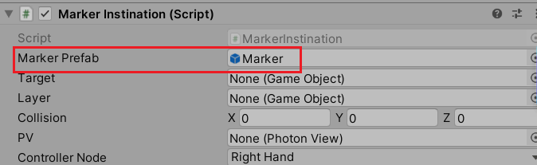
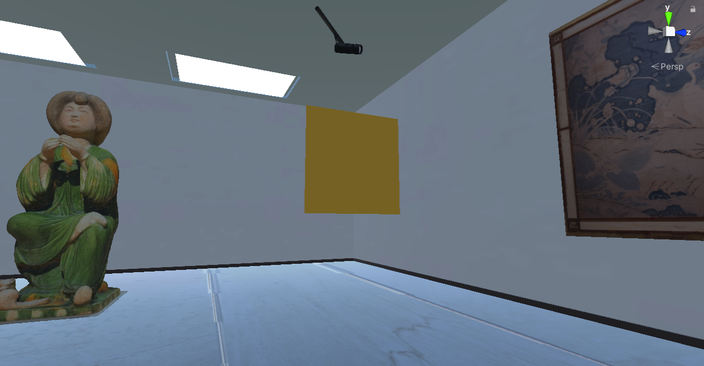
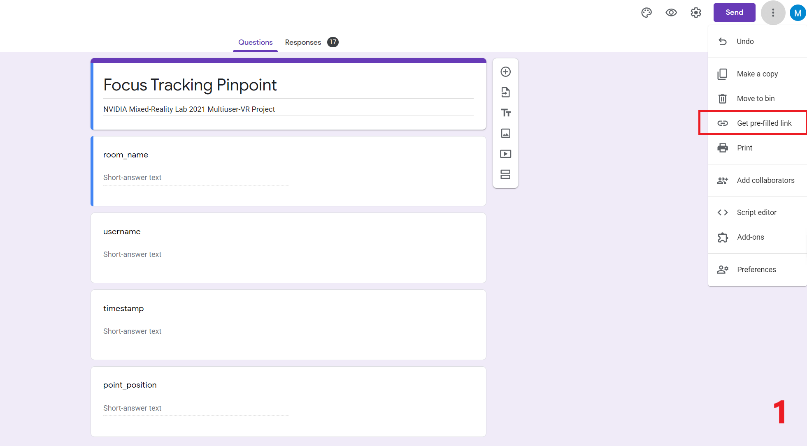
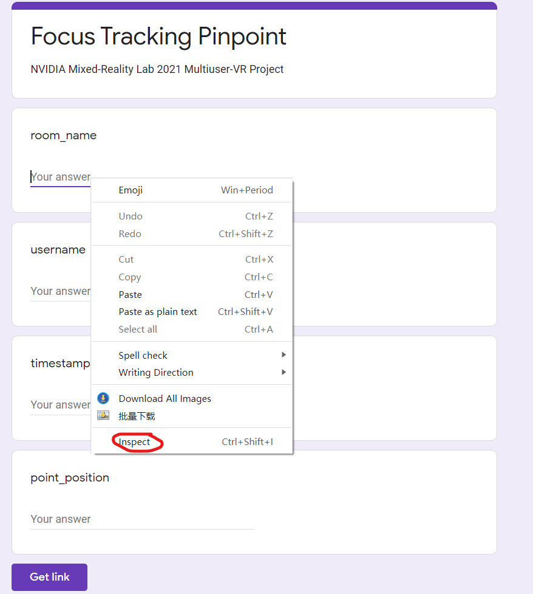
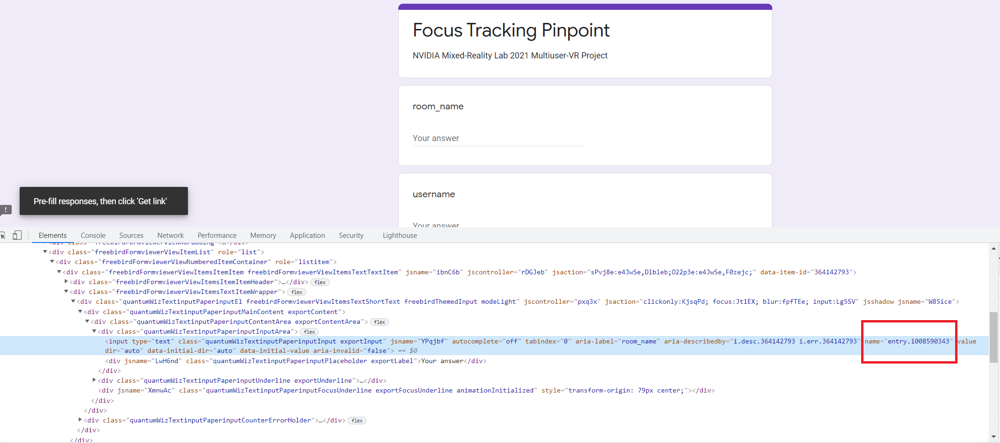

- [VR Development Basics](#vr-development-basics)
- [Multiplayer Virtual Reality Synchronization](#multiplayer-virtual-reality-synchronization)
- [Voice Chat Implementation](#voice-chat-implementation)
- [Multiplatform Development](#multiplatform-development)
- [Marker Instantiation](#marker-instantiation)
  - [Physics.Raycast](#physicsraycast)
  - [MarkerPrefab preparation](#markerprefab-preparation)
  - [PhotonNetwork.Instantiate](#photonnetworkinstantiate)
- [Save data to Google Spreadsheet](#save-data-to-google-spreadsheet)
  - [Create a form](#create-a-form)
  - [Send the data from Unity](#send-the-data-from-unity)
    - [Get the form response address](#get-the-form-response-address)
    - [Get the form entry id](#get-the-form-entry-id)

# VR Development Basics

# Multiplayer Virtual Reality Synchronization

# Voice Chat Implementation

# Multiplatform Development

# Marker Instantiation

When user is looking at an exhibit, he could add a mark add to that exhibit to highlight his focus point. The basic idea of this is to instantiation a new object and add it to the exhist exhibit.
## Physics.Raycast
A ray is an infinitely long line emitted in one direction from a point in the three-dimensional world. On the ray's trajectory, the emission stops once it collides with the model with the collider added. We can first use the ray to achieve positioning function, and then generate markers according to the coordinates.

```cpp
var ray = new Ray(this.transform.position, this.transform.forward);
RaycastHit hit;
if (Physics.Raycast(ray, out hit))
{
    // To-do
}
```

## MarkerPrefab preparation
- Create a new folder named **Resources** and put the marker prefab in it.
- Set this prefab to one **GameObject** in the following code.


## PhotonNetwork.Instantiate
After getting the position, you could use this position to instantiate a new marker. The difference between `PhotonNetwork.Instantiate` and `Instantiate` is that the former could instantiante a networked object which could be viewed by all users, while the later could only get a local object.
```cpp
public GameObject MarkerPrefab;

var ray = new Ray(this.transform.position, this.transform.forward);
RaycastHit hit;
if (Physics.Raycast(ray, out hit))
{
    // The raycast will estimate whether the collider is on target object 
    if (hit.collider.gameObject.tag == "painting")
    {
        GameObject target = PhotonNetwork.Instantiate(MarkerPrefab.name, hit.point, Quaternion.identity);
        target.transform.SetParent(layer.transform, false);
        target.transform.position = hit.point;
    
        StartCoroutine(Post(hit.point));
        StartCoroutine(Damage(5f,target));

    }

}
```


- [VR Development Basics](#vr-development-basics)
- [Multiplayer Virtual Reality Synchronization](#multiplayer-virtual-reality-synchronization)
- [Voice Chat Implementation](#voice-chat-implementation)
- [Multiplatform Development](#multiplatform-development)
- [Marker Instantiation](#marker-instantiation)
  - [Physics.Raycast](#physicsraycast)
  - [MarkerPrefab preparation](#markerprefab-preparation)
  - [PhotonNetwork.Instantiate](#photonnetworkinstantiate)
- [Save data to Google Spreadsheet](#save-data-to-google-spreadsheet)
  - [Create a form](#create-a-form)
  - [Send the data from Unity](#send-the-data-from-unity)
    - [Get the form response address](#get-the-form-response-address)
    - [Get the form entry id](#get-the-form-entry-id)
To destroy the object, you could this the following method. Becuase the noral `Destroy()`function could not destroy a networked object, only the `PhotonNetwork.Destroy()` could destroy the networked object. However, `PhotonNetwork.Destroy()` could not set when to destroy the object, so we should use the `StartCoroutine()` method.
```cpp
IEnumerator Damage(float seconds, GameObject gameobject)
{
    yield return new WaitForSeconds(seconds);
    PhotonNetwork.Destroy(gameobject);
}
```

Here display the marker:
<!-- 
 -->
<center class="half">
    
</center>

# Save data to Google Spreadsheet
[Tutorial Video](https://www.youtube.com/watch?v=z9b5aRfrz7M)
## Create a form
First, you need to create a google form.

## Send the data from Unity

```cpp
private string Focus_BASE_URL = "https://docs.google.com/forms/u/0/d/e/1FAIpQLSewak7bEnLm-mHYeJIXDzh8ghZVrtz6w5DXf7M3RikEuJCorQ/formResponse";

IEnumerator Post(Vector3 relativePos)
{

    WWWForm form = new WWWForm();

    string BASE_URL = null;
    System.DateTime currentTime = new System.DateTime();

    form.AddField("entry.1008590343", PhotonNetwork.CurrentRoom.Name.ToString());
    form.AddField("entry.302544606", PhotonNetwork.NickName.ToString());
    currentTime = new System.DateTime();
    currentTime = System.DateTime.Now;
    form.AddField("entry.1386772403", currentTime.ToString("s"));
    form.AddField("entry.527127655", relativePos.ToString("F6"));

    BASE_URL = Focus_BASE_URL;

    byte[] rawData = form.data;
    WWW WWW = new WWW(BASE_URL, rawData);
    yield return WWW;
}
```
### Get the form response address
After setting down the form, go to the pre-filled mode as the following picture. 

Then press `Ctrl+U` button to get the source code page, `Ctrl+F` to search for `Form Action` label.

### Get the form entry id
In the `pre-filled` page, right click each ansuer inputfiled and click `Inspect`.

Find the information as shown in the following image.


So far, we have finished the data save part. Once a maker is instantiated, the information will be stored.